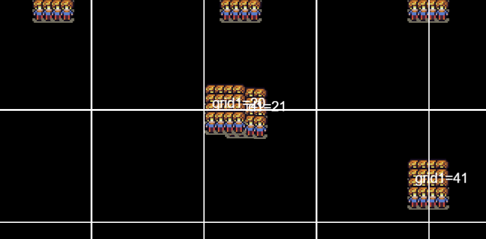

# realtimestrategyEcsMatter.github.io

## Spillet:
https://realtimestrategyecsmatter.github.io/

## Udviklings strategi:
Under udviklingen af spillet, har jeg defineret følgende principper:

* Det sværeste, skal udvikles først.
* Stres-test hver gang det er muligt.
* Refaktorering af kode - anvend "Data Driven" og "Entity Component System" design  

## Logbog:
Nedenfor har jeg skrevet de vigtigste tanker vedrørende projektet.  
Jeg har på forskellige tidspunkter haft forskellige fokuspunkter som man kan læse om nedenfor. 

### D.26/3 -2021

Har erkendt at for tildelingen til "uniform grid" har spilobjektet størrelse som et "punkt" 
Dette er ikke hensigsmæssigt!!! 
En spilobjekt burde kunne være i to "felter" på samme tid 
 
Nedenfor ses en grafisk-debug visning af problemet, de to enheder der overlapper er i hhv. "felt nr 21" og "felt nr 22" of kan altså ikke kollidere: 

### D.23/3 -2021
Brug af uniform grid collision.  Det ser ud som om flere felter med få objekter er bedre end få felter med mange objekter: 
Feks: opdeing af 100 objeketer 
10 felter * (10 objekter)^2 = 1000 beregninger 
20 felter * (5 objeketer)^2 = 500 beregninger 
osv. 

### D.22/3 - 2021
Der arbejdes på en form for "uniform-grid-collision-detection" 
Jeg har valgt at prøve at udvikle en simpel metode selv, baseret på to forskellige undform grids der er lidt forskudte. 

### D.27/2 - 2021
Det næste der skal ordnes er "full-skærm" på alle enheder 
https://www.w3schools.com/howto/tryit.asp?filename=tryhow_js_fullscreen2

### D.26/2 - 2021
Her er en lille dagbog over mit arbejde  
Jeg har fået tilføjet små animerede hærer der følger et "touch"  

